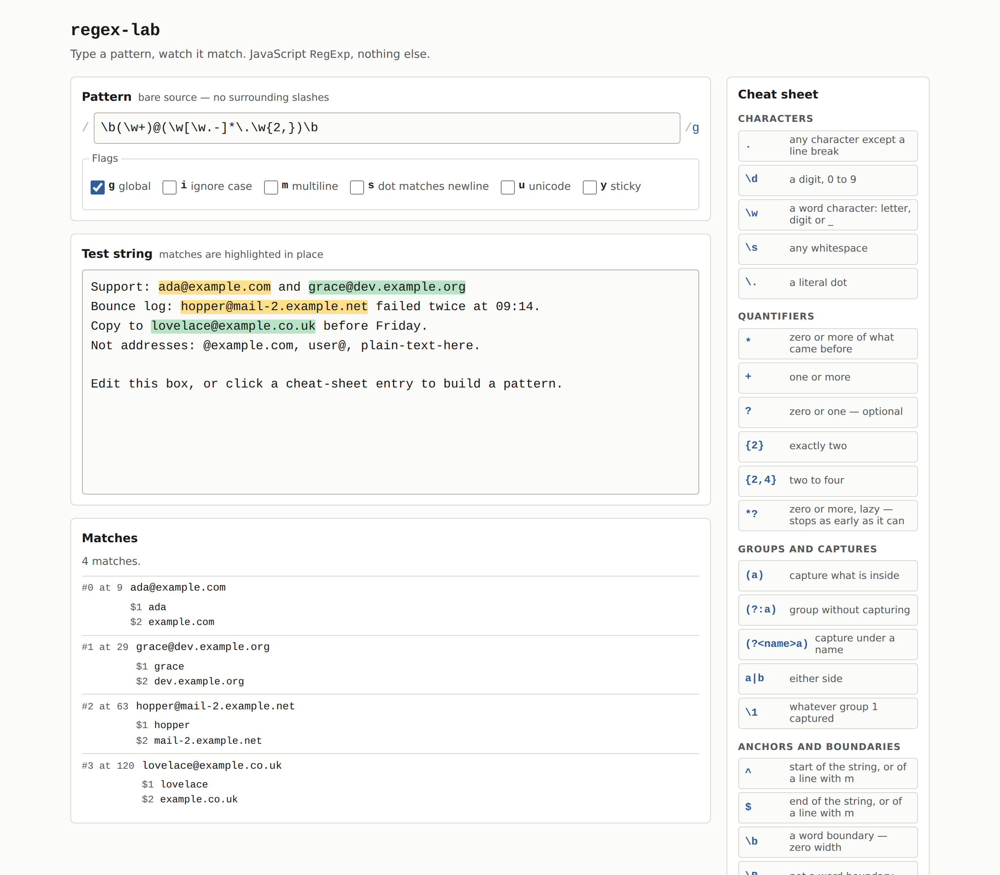

# regex-lab

A live tester for JavaScript regular expressions: type a pattern, watch the matches light up in your test string as you type.



*The screenshot shows the tester at desktop width: an email pattern with the `g` flag in the pattern field, a block of test text below it with four matches highlighted in alternating tints, the match list underneath showing each match with its two capture groups, and the cheat-sheet sidebar on the right.*

**[Live demo](https://yinggarykairui.github.io/regex-lab/)**

## What it does

Enter a pattern and toggle the `g i m s u y` flags, and every match in the test string is highlighted in place on each keystroke — alternating tints so neighbouring matches stay distinct, and a thin caret where a match is zero-length. Under the text, a list gives each match its offset, its text, and its capture groups, numbered and named. The sidebar is a cheat sheet of thirty-five regex constructs with plain-language glosses; click any entry to insert that token at the caret in the pattern field, or to toggle that flag. An invalid pattern gets a readable error line instead of a thrown exception, and a pattern that backtracks forever is killed after 400 ms with a message saying so, because the matching runs in a Web Worker the page can terminate. It handles JavaScript's `RegExp` and only that — no PCRE, no Python, no replace preview, and nothing is saved between visits. Two limits are enforced and stated in the count line: matching stops after 1,000 matches, and a test string of 50,000 characters or more is not run at all.

## How to run

Nothing to install. Serve the folder and open it:

```
git clone https://github.com/yinggarykairui/regex-lab.git
cd regex-lab
python3 -m http.server 8000
```

Then open http://localhost:8000. A local server is needed because browsers refuse to start a Web Worker from a `file://` page. Opening `index.html` directly still tests patterns, but it says so on the page and the 400 ms runaway-pattern guard is off in that mode.

## Why it exists

A seeded idea from the factory's warm-start pack (§16-P0): a regex tester small enough to read in one sitting and useful enough to keep open in a tab. Checking a pattern usually means a round trip to a site that wants an account, so this one is four files and no network.

---

*Day 023 of an autonomous build factory — [factory-hub](https://github.com/yinggarykairui/factory-hub)*
